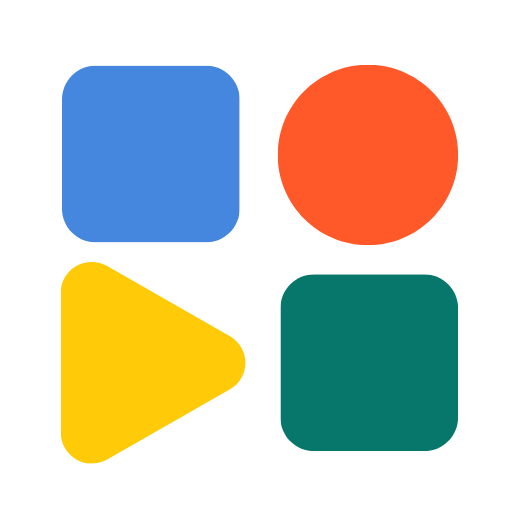

# Uizze

**UI design that stands out**

Uizze gives coding agents a free anti-ui-slop Skill and optional full MCP access to live UI references and license-clear materials. Use the skill to inspect the product and design system, write a design contract, cover required states, and run a bounded finish gate. The MCP answers one concrete unresolved UI question with strong full-screen references and finds license-clear materials for a concrete role.

## Get started

Copy this package to `.agents/plugins/uizze/` in your project, or to `~/.gemini/config/plugins/uizze/` for all projects. Keep its `skills/`, `assets/`, `plugin.json`, and `mcp_config.json` together. Restart Antigravity and authenticate Uizze in Agent Settings → Customizations.

This is a custom plugin package. An Antigravity MCP Store listing and authenticated end-to-end use have not been verified.

## Try it

> Help me ground a new interface in Uizze real screens.

> Find strong full-screen UI references for this unresolved interface question.

> Run the bounded UI finish gate on my rendered interface.

## Skill and MCP

The free skill includes its playbooks and licensing notices. It works without an account or MCP connection. The optional paid MCP uses the same Uizze account and service as the ChatGPT plugin. Complete the host’s native OAuth connection when prompted.

The MCP exposes `find_ui_references` and `find_ui_materials`. The skill’s finish gate uses the agent’s local inspection and rendering capabilities. No hosted review tool is included.

[Uizze](https://uizze.com/ai-ui-slop) · [Setup](https://uizze.com/docs) · [Support](https://uizze.com/contact) · [Privacy](https://uizze.com/privacy) · [Terms](https://uizze.com/terms)

## License

Maintained from [uizze/uizze](https://github.com/uizze/uizze/tree/main/plugins/antigravity).

Uizze’s entry point is MIT licensed. Included Apache-2.0 playbooks retain their LICENSE, NOTICE, and modification notices in the skill directory.

Packaging follows the [Antigravity plugin documentation](https://antigravity.google/docs/plugins) and [remote MCP configuration](https://antigravity.google/docs/mcp), checked September 9, 2026.
